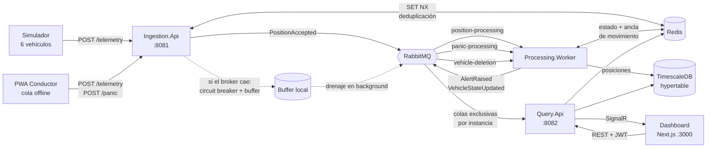

# Fleet Telemetry

Sistema de monitoreo y telemetría de flotas con GPS: ingiere coordenadas de múltiples vehículos,
detecta anomalías en tiempo real y las presenta en un dashboard operativo.

Prueba técnica para **Senior Fullstack Developer**. Stack: **.NET 10** (tres microservicios) +
**Next.js 16**, sobre **PostgreSQL/TimescaleDB**, **Redis** y **RabbitMQ**.

---

## Arranque

```bash
docker compose up --build
```

Un solo comando, sin pasos previos: todas las variables llevan valor por defecto de desarrollo, así
que funciona sobre un clon recién hecho. El entorno tarda ~2 minutos en construirse la primera vez.

| Servicio | URL | Credenciales |
|---|---|---|
| **Dashboard** | http://localhost:3000 | `operator` / `fleet-dev` |
| **Panel del conductor (PWA)** | http://localhost:3000/driver | — |
| API de ingesta | http://localhost:8081/openapi/v1.json | Cabecera `X-Api-Key: dev-fleet-key` |
| API de consulta | http://localhost:8082/openapi/v1.json | JWT del login |
| RabbitMQ (gestión) | http://localhost:15672 | `fleet` / `fleet_local_dev` |

El simulador arranca solo y empieza a emitir: **6 vehículos cada 2-5 segundos, con un 10% de
peticiones duplicadas y un 5% malformadas**, tal como pide el enunciado. Uno de los vehículos se
queda quieto a propósito para que la alerta de "Vehículo Detenido" aparezca sin esperar a que algo se
detenga por casualidad.


### Desarrollo: backend y frontend fuera de Docker

Para iterar sobre el código conviene dejar en contenedores solo la infraestructura y ejecutar los
servicios a mano, con recarga y depurador.

**1. Levantar solo la infraestructura** (publica sus puertos en `localhost`):

```bash
docker compose up -d timescaledb redis rabbitmq
```

**2. Aplicar el esquema** (una vez, o tras añadir un script SQL):

```bash
dotnet run --project backend/src/Services/FleetTelemetry.Migrator
```

**3. Los tres servicios, cada uno en su terminal:**

```bash
dotnet run --project backend/src/Services/FleetTelemetry.Ingestion.Api      # http://localhost:8081
dotnet run --project backend/src/Services/FleetTelemetry.Query.Api          # http://localhost:8082
dotnet run --project backend/src/Services/FleetTelemetry.Processing.Worker
```

**4. El frontend:**

```bash
cd frontend && npm install && npm run dev                                   # http://localhost:3000
```

**5. Opcional, el generador de tráfico:**

```bash
dotnet run --project backend/src/Tools/FleetTelemetry.Simulator
```

Los `appsettings.Development.json` ya apuntan a las credenciales que levanta el compose y los
perfiles de arranque fijan **los mismos puertos 8081 y 8082** que publica Docker. Así el frontend, el
simulador y esta documentación funcionan igual en los dos modos, sin definir una sola variable de
entorno ni confiar certificados de desarrollo.

Para volver al modo completo, `docker compose up --build` levanta también los servicios de
aplicación; conviene parar antes los `dotnet run` para no disputarse los puertos.

---

## Arquitectura



### Por qué tres servicios y no uno

Las tres responsabilidades tienen perfiles de carga incompatibles: la ingesta escribe miles de veces
por segundo y no puede caerse; el procesamiento tolera latencia y puede reintentar; la consulta
mantiene conexiones WebSocket abiertas, cada una con su coste de memoria. Con un solo proceso, un
pico de dashboards abiertos compite con la ingesta de GPS.

**Comparten un único bounded context.** La separación es por perfil de escalado, no por dominio, y se
declara así explícitamente: "vehículo" y "posición" son el mismo concepto en los tres servicios, y
partirlos daría el coste de los microservicios sin su beneficio. → [ADR-0001](docs/adr/0001-topologia-de-servicios.md)

### Capas, y cómo se impide que se degraden

```
Domain  ←  Application  ←  Infrastructure  ←  Services
```

`FleetTelemetry.Domain.csproj` **no tiene un solo `PackageReference`**. No es una aspiración: hay
tests de arquitectura (NetArchTest) que rompen el build si alguien mete EF Core, Redis, RabbitMQ,
Polly, ASP.NET o Serilog en el dominio o en la capa de aplicación. Una convención documentada se
erosiona en cuanto alguien tiene prisa; una restricción ejecutable, no.

Y esos tests se validaron invirtiendo temporalmente una regla para ver que **fallan de verdad**, en
lugar de confiar en una barra verde.

---

## Los cuatro problemas difíciles

### 1. Deduplicación — la trampa del enunciado

La clave de deduplicación es `dedupe:{vehículo}:{coordenada}:{timestamp}`, con `SET NX` y TTL corto.
**Incluir el timestamp es lo que hace que el sistema funcione.**

Si la clave fuera solo `vehículo + coordenada` —la lectura literal de "ignorar coordenadas idénticas
en la misma ventana"— un vehículo detenido, que emite la misma coordenada cada 2-5 segundos, vería
descartadas **todas** sus lecturas salvo la primera. El worker dejaría de recibir eventos suyos y la
alerta de "Vehículo Detenido" **no se generaría jamás**: la deduplicación habría desactivado
justamente la funcionalidad que se pide.

Con el timestamp dentro se descarta lo que de verdad es un duplicado (el mismo paquete reenviado, que
es lo que inyecta el simulador) y pasa la emisión legítima del vehículo parado.

`SET NX` y no *comprobar-luego-escribir*: dos peticiones simultáneas con el mismo paquete pasarían
ambas la comprobación antes de que ninguna escribiera.

### 2. Detección de vehículo detenido

`StoppedVehicleDetector` es una **función pura** sobre el último movimiento confirmado y la lectura
entrante. Sin dependencias de Redis ni del reloj del sistema, así que la regla más importante del
enunciado se testea en milisegundos y sobre todos sus bordes.

El ancla es la **última posición con movimiento confirmado**, no la última recibida. Un vehículo
parado sigue emitiendo; anclar en la última lectura reiniciaría el cronómetro en cada una y la alerta
no llegaría nunca. Tiene su propio test, junto con el borde exacto del umbral y las lecturas
desordenadas que llegan al drenar una cola offline.

El radio de tolerancia (10 m por defecto) existe porque un GPS civil en reposo deriva varios metros
por multipath. Con radio cero, ese ruido se leería como movimiento.

Un **cooldown** por vehículo y tipo de alerta evita que un camión aparcado genere cientos de alertas
idénticas: cumple la condición en cada lectura, cada 2-5 segundos.

### 3. Circuit Breaker — que la ingesta no caiga

Tres piezas encadenadas en `ResilientEventBus`: reintentos con backoff exponencial y *jitter* →
circuit breaker (Polly v8) → buffer local acotado con drenaje en segundo plano.

El orden importa. Los reintentos cubren el fallo transitorio. **El breaker cubre el sostenido**: sin
él, cada petición esperaría el timeout completo del broker y la ingesta moriría por agotamiento de
hilos aunque formalmente "no se hubiera caído". Con el circuito abierto el fallo es inmediato y
barato, y el mensaje va al buffer.

Medido, apagando RabbitMQ y enviando 10 lecturas:

```
lectura 1..10 → HTTP 202                    ← la ingesta NO cae
{"circuitState":"Open","publisherHealthy":false,"bufferedMessages":10,"droppedMessages":0}

… al levantar el broker …
Drenados 10 mensajes del buffer local; quedan 0
cola fleet.position-processing: 1 → 11 mensajes     ← cero pérdidas
```

El buffer descarta los mensajes **más antiguos** al llenarse: durante una caída prolongada, un
vehículo se localiza con su última posición, no con la de hace veinte minutos. → [ADR-0003](docs/adr/0003-mensajeria-y-resiliencia.md)

### 4. Eliminación consistente — saga con estado observable

Los datos de un vehículo viven en cuatro sitios y **no hay transacción que abarque PostgreSQL y
Redis**. En lugar de fingir atomicidad, el borrado es una saga en dos pasos con compensación. Tres
órdenes son deliberados y cada uno tiene su test:

1. **Guardar antes de publicar** — al revés, se procesaría el borrado de un vehículo cuya transacción
   luego se revierte.
2. **Bloquear la telemetría antes de purgar** — cierra la carrera en la que una posición en vuelo
   resucita lo que la saga está borrando.
3. **Caché antes que histórico** — la caché es lo que lee el dashboard, así que el vehículo
   desaparece de la pantalla del operador de inmediato aunque borrar millones de filas tarde.

Si un paso falla, **no se vuelve a `Active`**: el vehículo queda en `DeletionFailed` con el motivo,
visible y reintentable. Un borrado a medias es un hecho que hay que ver, no que ocultar. → [ADR-0005](docs/adr/0005-saga-de-eliminacion-de-vehiculos.md)

Verificado de extremo a extremo:

```
ANTES    vehículo: 1 | posiciones: 5 | alertas: 1 | Redis: 1 clave
DELETE → 202 {"accepted":true,"state":"PendingDeletion"}
DESPUÉS  vehículo: 0 | posiciones: 0 | alertas: 0 | Redis: 0 claves
```

---

## Decisiones técnicas

Cada decisión relevante tiene su registro con contexto, alternativas descartadas **y consecuencias
negativas**. Un ADR sin consecuencias negativas está incompleto.

| # | Decisión |
|---|---|
| [0001](docs/adr/0001-topologia-de-servicios.md) | Tres deployables sobre un único bounded context |
| [0002](docs/adr/0002-cqrs-con-dispatcher-propio.md) | CQRS con dispatcher propio en lugar de MediatR |
| [0003](docs/adr/0003-mensajeria-y-resiliencia.md) | RabbitMQ tras un puerto, con circuit breaker y buffer local |
| [0004](docs/adr/0004-timescaledb-para-el-historico.md) | TimescaleDB para el histórico, con esquema en scripts SQL |
| [0005](docs/adr/0005-saga-de-eliminacion-de-vehiculos.md) | Eliminación de vehículos como saga con estado observable |

**Por qué TimescaleDB** — las posiciones son una serie temporal pura: seis vehículos emitiendo cada
3 s generan ~170.000 filas al día. Una hypertable particionada por tiempo permite que el planner
descarte *chunks* enteros en vez de recorrer un índice sobre millones de filas, y la compresión y la
retención son declarativas. Es además el paralelo directo al Druid que ya usan en su plataforma.

**Por qué Next.js** — SSR y App Router para el arranque, pero sobre todo porque el mismo proyecto
sirve el dashboard de sala de control y la PWA del conductor sin duplicar el modelo de dominio del
cliente ni la capa de acceso a la API.

**Por qué un dispatcher CQRS propio** — MediatR pasó a licencia comercial y de él solo se necesitaban
dos cosas: resolver el handler y encadenar comportamientos transversales. Son ~120 líneas.

---

## Verificación

Nada de lo que se afirma aquí se dio por bueno sin ejecutarlo. Tras **4 horas de ejecución continua**:

| Métrica | Valor |
|---|---|
| Lecturas enviadas por el simulador | 27.540 |
| Duplicadas inyectadas | 2.374 (8,6%) |
| Malformadas inyectadas | 1.255 (4,6%) |
| **Rechazadas por la API** | **1.255** |
| Posiciones persistidas | 23.987 |
| Alertas generadas | 48 |
| Tests | 102 (80 backend, 22 frontend) |

El dato que importa: **rechazadas = malformadas, exactamente**. Se rechazó el 100% de los payloads
inválidos y **ni una sola lectura válida**. La validación no tiene falsos positivos.

Para reproducir las comprobaciones una a una está la guía de la skill
[`telemetry-verify`](.claude/skills/telemetry-verify/SKILL.md), que es el mismo guion que se siguió.

```bash
dotnet test backend/FleetTelemetry.sln --filter "FullyQualifiedName!~Integration"
cd frontend && npm run lint && npm test && npm run build
cd infra/terraform && terraform init -backend=false && terraform validate
```

---

## Arquitectura de la aplicación móvil

El enunciado pide responder a dos retos con independencia de si se programa el cliente. Aquí está
**implementado** como PWA en `/driver`, y estas son las respuestas.

### Offline First: el conductor entra en un túnel y pierde 10 minutos de conexión

**Lo que hace este prototipo.** La lectura se escribe **siempre** primero en IndexedDB y solo después
se intenta enviar. Ese orden es lo que hace que el túnel no pierda ni un punto: la red es un detalle
de entrega, no la fuente de verdad.

IndexedDB y no `localStorage`: diez minutos sin cobertura son unas 200 lecturas, y una jornada
completa son miles. `localStorage` ronda los 5 MB, es **síncrono** —bloquearía la interfaz en el
dispositivo más lento del sistema— y no permite borrar por lote lo confirmado sin reescribir todo.

**Cómo se sincroniza sin saturar el servidor.** Tres mecanismos:

1. **Lotes acotados** (50 lecturas). Enviar 200 peticiones de golpe por cada conductor que sale del
   túnel es exactamente cómo se tumba un servidor justo cuando vuelve la red.
2. **Backoff exponencial con techo** (2 s → 60 s). Reintentar cada segundo dentro de un túnel gasta
   batería sin ninguna posibilidad de éxito; el techo evita que tras una avería larga la app tarde
   horas en recuperarse.
3. **Orden cronológico**, más antiguo primero. El backend deriva la detección de detención comparando
   lecturas consecutivas: desordenarlas falsearía el cálculo.

Una lectura que falla 5 veces se abandona. Sin ese tope, un payload corrupto bloquearía la cola y el
conductor dejaría de reportar del todo.

**Qué añadiría en producción.** Compresión del lote (gzip sobre un array de posiciones baja el
tamaño ~80%), un endpoint `POST /telemetry/batch` para no gastar una petición por punto, *jitter*
aleatorio en la reconexión para que 50 camiones saliendo del mismo túnel no golpeen a la vez, y
`Background Sync` de la Service Worker API para que la sincronización ocurra aunque la app esté
cerrada.

### Batería: leer el GPS cada segundo la drena

Leer GPS a 1 Hz de forma continua consume del orden de 30-50 mA solo en el receptor, además de
impedir que el SoC entre en estados de bajo consumo. Estrategias, de mayor a menor impacto:

**1. Frecuencia adaptativa al contexto, no fija.** Es la que más ahorra. Un vehículo parado no
necesita la misma cadencia que uno en autopista:

| Situación | Cadencia | Por qué |
|---|---|---|
| Detenido (detectado por acelerómetro) | 1 lectura / 60 s | No hay nada que reportar |
| Tráfico urbano lento | 1 / 10 s | La posición cambia poco entre lecturas |
| Carretera abierta | 1 / 3 s | La ruta necesita resolución |
| Alerta activa o pánico | 1 / 1 s | Aquí la precisión sí vale la batería |

**2. Delegar el despertar al sistema operativo.** En Android, `FusedLocationProviderClient` con
`setMinUpdateDistanceMeters` hace que el SO entregue actualizaciones solo cuando el dispositivo se ha
movido de verdad, agrupando la entrega con otros *wakeups* del sistema. En iOS, *significant location
changes* usa las antenas de telefonía en vez del GPS y permite que la app despierte solo cuando toca.
Es más eficiente que cualquier temporizador propio porque el SO coordina todas las apps a la vez.

**3. Geofencing en lugar de polling** para los eventos de entrada y salida de zonas: el SO lo resuelve
con el hardware de bajo consumo y despierta la app solo en la transición.

**4. Agrupar la radio.** Cada envío enciende el módem, que se queda en estado activo unos segundos
después. Enviar 10 posiciones juntas cuesta aproximadamente lo mismo que enviar una, así que la
misma cola por lotes que resuelve el offline **también** ahorra batería en condiciones normales.

**5. Acelerómetro como filtro previo.** Es órdenes de magnitud más barato que el GPS: si el
acelerómetro no detecta movimiento, no hace falta encender el receptor. En este sistema encaja
especialmente bien porque la regla de negocio principal es justamente "no se ha movido".

**6. Degradar por batería.** Por debajo del 15%, bajar la cadencia y priorizar solo los eventos
críticos: la posición es útil, pero un teléfono apagado no reporta nada.

---

## Reporte de IA

### Qué herramientas usé

**Claude Code (Opus)** como par de programación durante toda la construcción, en una sesión larga
conduciendo el trabajo rama a rama. No se usaron otras herramientas de IA.

### Para qué me apoyé en ella

- **Andamiaje y trabajo repetitivo**: estructura de la solución, configuración de EF Core, los cinco
  Dockerfiles y compose, workflows de CI/CD y el grueso del Terraform.
- **Generación del simulador** con inyección de fallos: rutas plausibles por Bogotá, deriva de GPS en
  reposo y las cuatro variantes de payload malformado.
- **Boilerplate de la UI**: tabla, panel de alertas, integración de Leaflet y del cliente SignalR.
- **Redacción de los ADRs y de este README** a partir de las decisiones ya tomadas.
- **Barrido de bordes en los tests**: al pedirle explícitamente los casos límite, propuso el de la
  lectura desordenada que llega al drenar la cola offline, que no estaba en mi lista inicial.

### Qué salió mal, y cómo lo corregí

Esta es la parte que importa. La IA acierta mucho y falla de formas concretas:

**1. Teselas de mapa que exigían API key.** Propuso el estilo oscuro de CARTO, que era correcto hace
un tiempo pero hoy requiere clave y estampa "API KEY REQUIRED" sobre el mapa. **Solo se vio abriendo
el navegador.** Corregido con OpenStreetMap y un filtro CSS sobre el panel de teselas — los
marcadores viven en otro panel de Leaflet y conservan su color real, que es lo que hace legible el
estado de un vistazo.

**2. `setState` síncrono dentro de efectos de React 19.** Escribió el patrón clásico de hidratar
sesión desde `sessionStorage` en un `useEffect`. React 19 lo marca como error
(`react-hooks/set-state-in-effect`) y lo detectó el CI, no yo — **no había ejecutado `npm run lint`
antes de abrir el PR**. Se corrigió de raíz con `useSyncExternalStore`, que es la API pensada
exactamente para leer un store externo del navegador de forma segura con SSR, en lugar de silenciar
la regla.

**3. El contenedor del dashboard reportaba `unhealthy` sirviendo tráfico perfectamente.** 22
healthchecks fallidos seguidos. La causa no estaba en el código de la app: el servidor standalone de
Next hace *bind* a `process.env.HOSTNAME`, y **Docker define esa variable con el id del contenedor**,
que resuelve a su IP privada. Escuchaba solo en `172.21.0.9`. En producción esto es un servicio que
el orquestador reinicia en bucle sin tener nada malo. Diagnosticado con `netstat` dentro del
contenedor, resuelto con `ENV HOSTNAME=0.0.0.0`.

**4. Faltaba CORS en la API de ingesta.** La PWA del conductor *parecía* estar sin cobertura con el
servidor al lado: el navegador bloqueaba cada lectura en el preflight porque la API key viaja en una
cabecera propia. Detectado mirando la consola del navegador. Lo llamativo fue el efecto colateral: el
comportamiento degradado resultó ser el correcto, las lecturas se encolaron en vez de perderse.

**5. El `.gitignore` incluía `.terraform.lock.hcl`.** Es un antipatrón conocido: ese archivo fija los
checksums de los proveedores y **debe** versionarse, o dos personas pueden planificar la misma
configuración contra proveedores distintos.

**6. Se mergeó un PR con un job en rojo.** El script de espera llamaba a `gh pr merge` sin comprobar
el resultado de los checks. El fallo resultó ser un `502` transitorio del registry y `main` quedó
verde, pero el proceso fue incorrecto; se corrigió añadiendo la comprobación explícita antes de
mergear.

### Mi criterio, dónde cambió lo que proponía

Más allá de los errores, hubo decisiones donde no acepté la primera propuesta:

- **La clave de deduplicación.** La lectura literal del enunciado lleva a `vehículo + coordenada`,
  que es lo natural. Razonar el flujo completo mostró que eso **desactiva la alerta de vehículo
  detenido**. Es el hallazgo del que más orgulloso estoy de esta prueba, y no salió de la herramienta.
- **El buffer de respaldo en memoria y no en la base de datos.** Un outbox en Postgres tiene mejores
  garantías, pero la base puede ser justamente lo que está caído: un fallback que depende del
  componente que falló no es un fallback.
- **La compensación de la saga no devuelve el vehículo a `Active`.** Ya perdió parte de sus datos;
  mostrarlo como operativo daría un estado incoherente al operador.
- **`IMessagePublisher` extraído** para poder testear la política de resiliencia sin levantar un
  broker. El código original dependía de la clase concreta y la parte más importante del sistema
  habría quedado sin test unitario.

La regla que apliqué en todo momento: **verificar ejecutando, no leyendo**. Los seis problemas de
arriba son exactamente los que un `dotnet build` en verde no habría revelado.

---

## Desafíos y Soluciones

### Lo resuelto

**El conflicto entre deduplicar y detectar detención.** Descrito arriba. Es el problema más sutil de
la prueba y afecta al requisito central.

**Distinguir "reparto de trabajo" de "difusión".** El worker quiere que cada mensaje lo procese una
sola réplica; el servidor de WebSockets necesita que **todas** las réplicas reciban todo. Con una
cola durable compartida, RabbitMQ repartiría los mensajes y solo los navegadores conectados a una
instancia verían cada actualización. Los consumidores de difusión declaran colas exclusivas con
nombre generado por el servidor, que además se autodestruyen al desconectarse la réplica.

**Idempotencia del consumidor.** La cola entrega *at-least-once*: un reinicio reprocesa mensajes. La
clave primaria `(vehicle_id, recorded_at)` —que TimescaleDB **exige** que incluya la columna de
particionado— permite un `ON CONFLICT DO NOTHING` que hace el reproceso inofensivo. La restricción
del motor y la garantía que hacía falta coincidieron.

**Reconexión que se rendía.** La política por defecto de SignalR reintenta cuatro veces y abandona:
en una sala de control eso es quedarse en polling el resto del turno tras un parpadeo. Reintentos
ilimitados, más un bucle aparte para el caso que `withAutomaticReconnect` no cubre en absoluto — que
el backend ya esté caído cuando se abre el dashboard.

### Lo que sé que falta

Estas son limitaciones reales, no futuras mejoras hipotéticas:

**El buffer de respaldo vive en memoria.** Si el proceso muere mientras contiene mensajes, se
pierden. Es la contrapartida consciente de no depender del disco ni de la base de datos. En
producción sería un outbox en disco local o un volumen persistente.

**Un vehículo puede quedarse en `PendingDeletion` para siempre** si el worker está caído justo
después de aceptar el borrado. Es visible en el dashboard, pero nadie lo resuelve solo: falta un
proceso de barrido que reintente los que llevan demasiado tiempo en ese estado.

**No hay tests de integración con Testcontainers.** El proyecto está creado y las dependencias
declaradas, pero el tiempo se fue en verificar el sistema real de extremo a extremo, que consideré
más valioso para esta entrega. Es la primera deuda que pagaría.

**Autenticación de prototipo.** Una API key compartida para todos los dispositivos no permite revocar
uno concreto; en producción sería una credencial por dispositivo con rotación. El JWT del dashboard
se guarda en `sessionStorage` —muere al cerrar la pestaña, mejor que `localStorage` en un equipo
compartido— pero sigue siendo vulnerable a XSS: lo correcto es una cookie `httpOnly`.

**TimescaleDB no está disponible en RDS gestionado.** La limitación más importante del despliegue.
Las salidas reales son Timescale Cloud, Postgres autogestionado, o renunciar a la hypertable y usar
particionado declarativo nativo.

**Sin autoescalado ni observabilidad distribuida.** El Terraform fija réplicas y no hay trazas
OpenTelemetry. Con el `correlationId` que ya se propaga por los tres servicios, añadir tracing
distribuido sería directo y es lo primero que montaría antes de un despliegue real.

### Qué haría diferente con más tiempo

1. **Tests de integración con Testcontainers** contra Timescale, Redis y RabbitMQ reales.
2. **OpenTelemetry** de punta a punta, aprovechando el `correlationId` existente.
3. **Endpoint `POST /telemetry/batch`** para la sincronización offline: hoy la PWA gasta una petición
   por punto porque el endpoint del enunciado recibe uno solo.
4. **Autoescalado de ECS** por profundidad de cola en el worker y por CPU en la ingesta.
5. **Particionar Redis por vehículo** si la flota creciera: hoy el índice de vehículos vivos es una
   sola clave, y con decenas de miles de vehículos sería un punto caliente.

---

## Estructura

```
backend/
  src/BuildingBlocks/{Domain,Application,Infrastructure,Contracts}
  src/Services/{Ingestion.Api,Processing.Worker,Query.Api,Migrator}
  src/Tools/Simulator
  tests/{Domain,Application,Infrastructure,Architecture,Integration}.Tests
frontend/src/features/{auth,fleet,alerts,driver}/{domain,api,hooks,ui}
infra/terraform          # ECS Fargate, RDS, ElastiCache, Amazon MQ
docs/adr                 # decisiones arquitectónicas
.claude/                 # guía, reglas y skills para agentes de IA
```

`CLAUDE.md`, `.claude/rules/` y `.claude/skills/` versionan las convenciones del proyecto y los
flujos repetibles para trabajar con asistentes de IA. Están en el repositorio a propósito: si la
herramienta forma parte del proceso, sus reglas son parte del código.

---

## Video de sustentación

> _Pendiente de grabar._ El guion, con la secuencia de demostración y los puntos de arquitectura a
> defender, está en [`docs/video-script.md`](docs/video-script.md).
